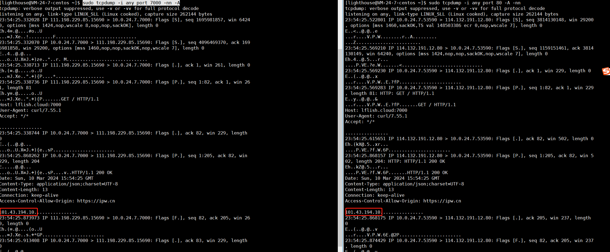

通过几个简单的工具进行下实战, 模拟下代理的访问路径，环境如下

**目标服务器: 4.ipw.cn**
**代理机器: lflish.cloud(云机器)**

```
#本机->4.ipw.cn
C:\Users\Administrator>curl 4.ipw.cn
111.198.1.1
```
通过本机请求目标机显示，当前出口IP是111.198.1.1

```
#代理服务器->4.ipw.cn
[root@centos]$ curl 4.ipw.cn
101.43.194.10
```
通过代理服务器请求目标机，显示当前出口IP是101.43.194.10

### ncat
号称网络界的瑞士军刀，平时确实很常用,接下试下客户端使用代理服务器访问目标机，也即是
```
本机->flish.cloud->4.ipw.cn
```

代理服务器配置如下:
```shell
###监听本机7000端口，将数据转发到 4.ipw.cn的80端口
ncat --sh-exec "ncat 4.ipw.cn 80" -l 7000  --keep-open
```

本机访问
```
C:\Users\Administrator>curl lflish.cloud:7000
101.43.194.10
```
这里直接访问代理服务器的7000端口，然后代理服务器会转发数据到目标机，并返回数据,为了方便区别特意用了不同的端口。
如果本机配置了hosts,并且代理服务器是使用80端口，那么结果会如下
```
C:\Users\Administrator>curl 4.ipw.cn
101.43.194.10
```

这里nc只是单纯的数据转发，达到了隐藏源IP的目的，也即是骇客口中的跳板机, 但是这里客户端->到代理服务器数据未进行加解。


### ssh实战
### iptables实战